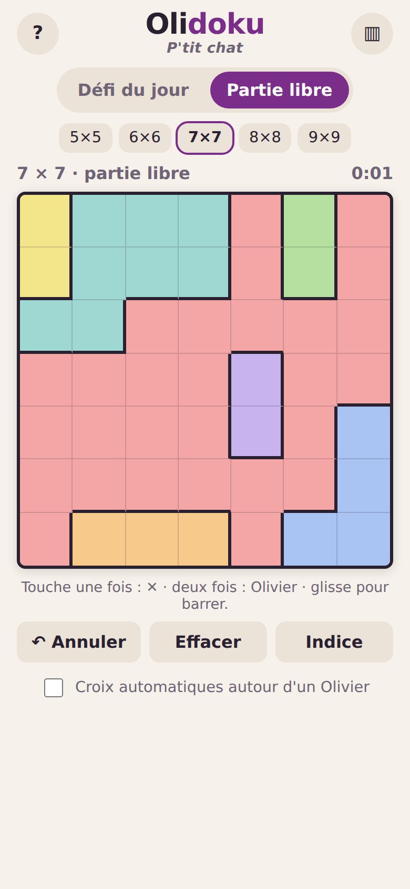

# Olidoku

Un casse-tête logique quotidien façon **Mewdoku**, mais avec le visage du chroniqueur
**Olivier Niquet** à la place des chats. *P'tit chat.* Conçu pour le cellulaire, **sans pub**.

Place un Olivier dans chaque rangée, chaque colonne et chaque région de couleur…
sans que deux Olivier se touchent, même en diagonale.



## Jouer

- Ouvre `index.html` dans un navigateur, c'est tout : aucun serveur ni compilation requis.
- **Défi du jour** : la même grille pour tout le monde, chaque jour. 5 × 5 le lundi,
  jusqu'à 9 × 9 le dimanche.
- **Partie libre** : grilles aléatoires de 5 × 5 à 9 × 9.
- Chaque grille a **une seule solution** (vérifiée par le solveur).
- Règles complètes : [docs/REGLES.md](docs/REGLES.md).

## Structure

```
index.html            Page unique (jeu + fenêtres)
css/style.css         Styles, mobile d'abord, mode sombre automatique
js/moteur.js          Génération des grilles, solveur, conflits, indices (sans DOM, testable)
js/app.js             Interface : toucher/glisser, annuler, chrono, sauvegarde, stats
img/                  Visage d'Olivier, icônes, aperçu
tests/test-moteur.js  Tests du moteur (Node)
docs/                 Règles, images à fournir, publication
```

## Images

Photo d'Olivier : `img/olivier.png` (et sa version recadrée `img/olivier-case.webp` pour
la grille). Voir [docs/IMAGES.md](docs/IMAGES.md).

## Développement

Il faut [Node.js](https://nodejs.org/) seulement pour les tests (pas pour jouer).

```bash
npm test            # tests du moteur
npm run serve       # petit serveur local (facultatif)
```

## Publier

GitHub Pages ou itch.io : voir [docs/PUBLIER.md](docs/PUBLIER.md).

## Principes

- Aucune pub, aucun traqueur, aucune dépendance externe.
- Tout fonctionne hors ligne une fois la page chargée.
- Progression et statistiques gardées dans le navigateur (localStorage).
- Projet de fan, non affilié à Olivier Niquet ni à Mewdoku.
